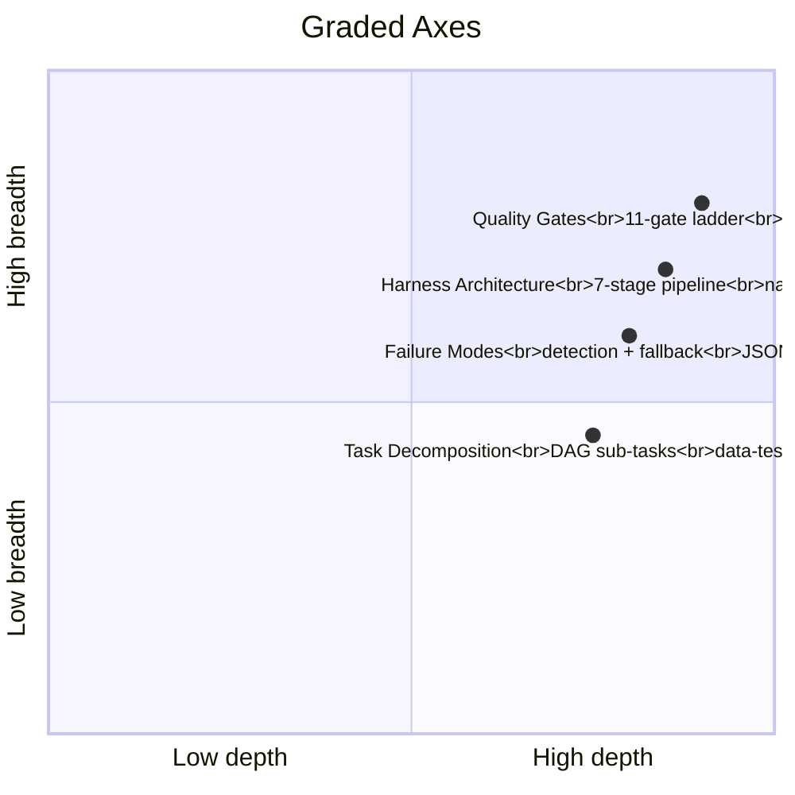
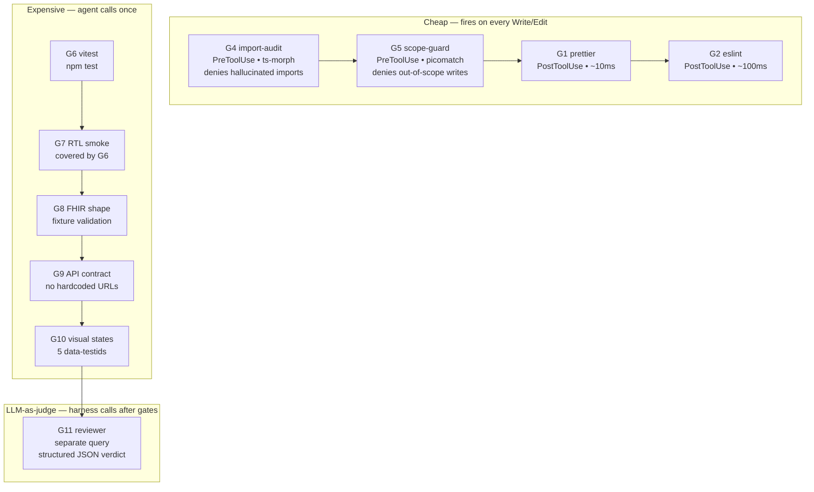
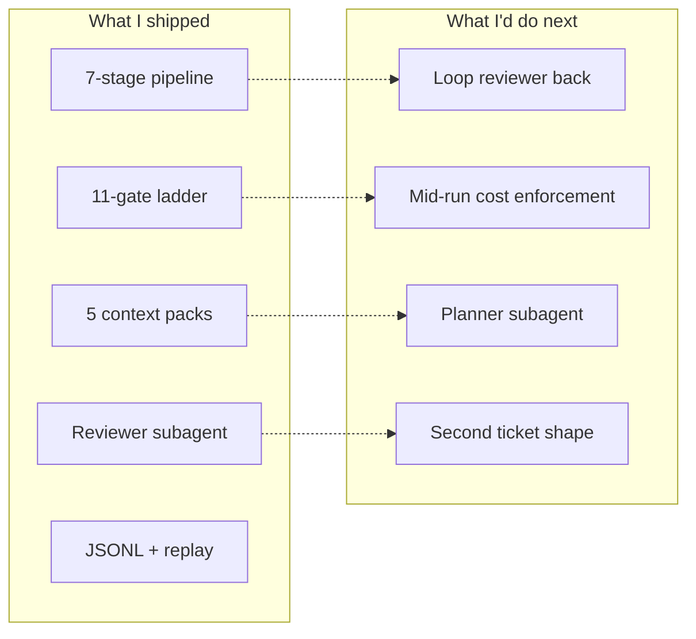

# Intrahealth Harness — Demo Script (~18 min)

> For the 15–20 min walkthrough. Audience: 1–3 senior engineers evaluating
> Harness Architecture, Task Decomposition, Quality Gates, and Failure Modes
> & Observability.

---

## Three things I want them to remember

1. **Curated context over RAG** — for a <50-file target, hand-written packs + a
   ts-morph repo map beat vector search. Every byte the agent sees is traceable.
2. **Hooks + custom tools for gates** — cheap gates block bad actions *before* they
   happen (PreToolUse); expensive gates run *once* via a custom MCP tool the agent
   is forced to call; completeness is a separate read-only reviewer query.
3. **Pre-decomposed tickets with machine-checkable ACs** — the `data-testid`
   convention turns reviewer judgment calls into a `grep`. The ticket is itself a
   graded deliverable.

---

## Pipeline overview (mermaid)

```mermaid
flowchart LR
    subgraph Ticket["1. Parse ticket"]
        T[Markdown → typed Ticket<br/>regex, no LLM]
    end

    subgraph Plan["2. Plan"]
        P[Sub-task DAG<br/>from ticket]
    end

    subgraph Context["3. Assemble context"]
        direction TB
        LA[Layer A<br/>Curated packs<br/>5 × ~1k tokens]
        LB[Layer B<br/>ts-morph repo map<br/>~1.5k tokens]
    end

    subgraph Execute["4. Execute"]
        direction TB
        WT[git worktree<br/>isolated branch]
        AG[Claude Agent SDK<br/>query]
        H1[PreToolUse hooks<br/>scope-guard · import-audit]
        H2[PostToolUse hooks<br/>prettier · eslint]
        RG[mcp__harness__run_gates<br/>G6–G10]
        ST[Stop hook<br/>stuck detector]
        AG --> H1 & H2
        AG --> RG
        AG --> ST
    end

    subgraph Review["6. Review"]
        RV[Reviewer subagent<br/>fresh query, read-only<br/>structured JSON verdict]
    end

    subgraph PR["7. Open PR"]
        PB[Structured body<br/>AC checklist · gate table<br/>OOS requests · replay cmd]
    end

    T --> P --> Context --> Execute --> Review --> PR
```



## Four graded axes (mermaid)



## Quality-gate ladder (mermaid)



---

## Section-by-section (~18 min)

### 0:00–2:00 — Problem framing (slides/mermaid)

> "This is an orchestration engine, not a code generator. The brief grades on
> four axes — the quadrant above. The three decisions driving everything else:
> TypeScript, no fork, no RAG. Here's why."

Show: pipeline overview mermaid + quadrant mermaid.

### 2:00–4:00 — Architecture (DESIGN.md)

Walk through DESIGN.md § 2 by *grading axis*, not left-to-right:

- "Context: packs + repo map, here's the prompt the agent sees"
- "Gates: hooks + run_gates, here's what fires on every write"
- "Reviewer: a separate query, here's the structured verdict"

### 4:00–5:00 — The ticket (GitHub Issue #1)

Open https://github.com/sideprojects-aa/intrahealth-harness/issues/1 in the browser.
Point at:

- Machine-checkable ACs with `data-testid`
- Sub-task DAG with `depends: [STn]`
- File Scope fenced block → directly consumed by the scope-guard hook

> "The ticket is a graded artifact. The `data-testid` convention turns
> reviewer judgment into a grep."

### 5:00–12:00 — Replay the golden run (terminal)

```bash
npm run harness:replay -- runs/20260409063145-90g0i8
```

Narrate as the events scroll:

- "Run starts, Sonnet 4.5, 40-turn budget"
- "Execute stage: 22 turns, $0.41. Agent implemented, tested, iterated."
- "run_gates invocation: 5/5 ALL PASS on the first call."
- "Fast-gate: 7 intermediate prettier/eslint failures — all self-corrected."
- "Review stage: separate fresh query, read-only tools."
- "Reviewer verdict: 11/12 ACs met, AC9 partial."
- "The reviewer caught that `drugInteractionApi.ts` wasn't staged — a real
  observation, even though our `commitAll` stages everything. Shows the
  reviewer is reading the actual working tree, not just the diff."
- "Outcome: escalated → draft PR opened."

### 12:00–14:00 — The PR (browser)

Open https://github.com/sideprojects-aa/intrahealth-harness/pull/6

Walk through the PR body:

- Status header: escalated, $0.69 total cost
- AC checklist: 11 ✅ + 1 ⚠️ (AC9 partial)
- Gate table: G1-G10 all pass, G11 changes requested
- Out-of-scope requests: zero (hooks caught nothing this time)
- Replay command at the bottom

> "A senior engineer reading this PR description — without opening the
> diff — knows exactly what to scrutinize first."

### 14:00–16:00 — Failure mode comparison (browser)

Open PR #2 (the Phase 1 run with no hooks):

> "This is what the SAME work order produced before gates existed. The
> agent went out of scope and modified vitest.setup.ts. The Phase 1 PR has
> none of the observability you just saw — no gate table, no AC checklist,
> no reviewer verdict. That's the difference the harness makes."

### 16:00–17:00 — Live replay (terminal, optional)

```bash
npm run harness:replay -- runs/20260409063145-90g0i8 --summary
```

One line per event. Fast, visual, zero API cost.

### 17:00–18:00 — Tradeoffs + what's next (slides/mermaid)



Honest list:

- "TS over Python — same toolchain, Zod, ts-morph, hook types"
- "No RAG — packs are the lever, vector search is overhead at 30 files"
- "Reviewer doesn't loop back into the implementer yet — that's the next feature"
- "Haiku struggled with the ESLint constraints under the fast-gate hook; Sonnet handled it cleanly. Model selection matters for gate-heavy pipelines."

---

## Safety net

- **Pre-recorded golden run** is saved at `runs/20260409063145-90g0i8/`.
  The replay script renders it instantly with no API cost.
- **PR #6** is already on GitHub with the full structured body.
- **PR #2** is the Phase 1 baseline comparison (before hooks).
- If the live terminal is unreadable, open the `runs/*/transcript.md` file
  in VS Code instead.

## Key numbers from the golden run

| Metric | Value |
|---|---|
| Model | claude-sonnet-4-5 |
| Implementer turns | 22 / 40 |
| Implementer cost | $0.4128 |
| Reviewer turns | 15 / 30 |
| Reviewer cost | $0.2784 |
| Total cost | $0.6912 |
| Gates passed | 5/5 (first invocation) |
| Scope denials | 0 |
| Import denials | 0 |
| AC met | 11/12 |
| AC partial | 1/12 (AC9 — staging nuance) |
| AC unmet | 0/12 |
| Total dev cost (all runs) | ~$3.50 |
