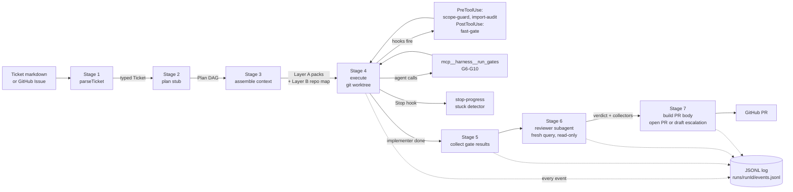
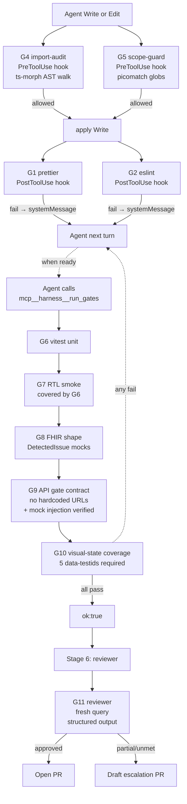

# DESIGN — Intrahealth Harness

> The architecture writeup for the graded interview deliverable.
> Companion repo to this document: [`README.md`](./README.md).

This is an **AI engineering harness**, not a drug interaction checker. The harness is the orchestration layer between a structured ticket and a shipped pull request. The drug interaction checker (an `InteractionReviewPanel` React component) is the work order I feed in to prove the machinery works.

The brief grades on four axes — **Harness Architecture, Task Decomposition, Quality Gates, Failure Modes & Observability** — and explicitly says "depth over breadth." This document treats each axis with the depth it deserves and names the trade-offs.

---

## 0. TL;DR

Three calls drive everything else. They are listed first because they are the load-bearing decisions and any defense of the design starts here.

1. **TypeScript over Python for the harness engine.** The Claude Agent SDK ships in both. I picked TS because the target codebase is TS/React, and that lets *one* `tsc`/`eslint`/`vitest` toolchain serve both the harness and the seed it operates on. It also gives me `ts-morph` for the import-audit hook (an AST walk over every write the agent attempts) and Zod for typed custom-tool schemas. Hook callback inputs are discriminated unions in TS (`HookInput`); the Python equivalent is dicts. For an exercise where graders read the code, the TS types catch mistakes the Python version wouldn't.

2. **Custom seed repo, NOT a fork of `medplum/medplum`.** The Medplum monorepo is >100k LOC. Cloning, installing, and building it burns 5–15 minutes per run — catastrophic for the iteration loop and the live demo. More importantly, with the full monorepo I cannot *curate* what the agent sees, which makes the context-assembly story indefensible. A custom Vite + React + TS seed (that imports `@medplum/core` + `@medplum/react`) is the honest expression of the "harness is the point" framing in the brief. Both the harness and the seed live in **one** repo with the seed as a `seed/` subfolder.

3. **No RAG / no embeddings for context delivery.** For a ~30-file seed repo, vector search is strictly worse than a hand-written context pack and a compiled repo map: opaque relevance, infrastructure cost, hallucinated "related" hits, and the pack quality is the actual lever. I lean on a three-layer strategy (curated packs eager + ts-morph repo map eager + on-demand retrieval tools lazy) and explicitly do not reach for an embedding store. Vector search earns its keep above thousands of files; we're below that threshold by two orders of magnitude.

The rest of this document is the consequences of those three calls.

---

## 1. The four graded axes

| Axis | Section | One-line |
|---|---|---|
| Harness Architecture | §2 | 7-stage pipeline, named SDK primitives per stage, single `RunState` flowing through |
| Task Decomposition | §3 | Pre-decomposed ticket with DAG sub-tasks, machine-checkable acceptance criteria via `data-testid` convention |
| Quality Gates | §4 | 11-gate ladder: cheap gates as PreToolUse/PostToolUse hooks, expensive gates as a custom MCP tool the agent is forced to call, completeness as a separate reviewer subagent |
| Failure Modes & Observability | §5 | Detection + fallback for each of: context blowup, hallucination, scope tangent, stuck loops, cost/latency. Structured JSONL logs, replayable, dense PR description |

---

## 2. Harness Architecture

### 2.1 Pipeline overview



A `RunState` object flows through all seven stages. Every stage emits structured log events to the run's `events.jsonl`. Every stage is independently testable.

### 2.2 Stages

| # | Stage | Input → Output | SDK primitives |
|---|---|---|---|
| 0 | **Trigger** | `npx harness run --ticket ...` | None — plain CLI argv parsing |
| 1 | **Parse ticket** | issue markdown → typed `Ticket` | Pure regex/markdown parsing in `src/parseTicket.ts`. **No LLM call** — graders penalize unnecessary model use on structured data. 9 unit tests cover the parser. |
| 2 | **Plan** | `Ticket` → `Plan` (DAG of sub-tasks) | Phase 1 stub: identity transform of the ticket's `## Sub-Tasks (DAG)` section. Phase 2+ would add a planner subagent that *refines* the human-authored coarse decomposition. |
| 3 | **Assemble context** | `Ticket + Plan` → `ContextBundle` (packs + repo map) | `loadPacks` reads ticket-named packs from `context-packs/medplum/`. `buildRepoMap` walks the worktree's `seed/src` with `ts-morph` and emits a compact symbol index. Both go into the implementer's `systemPrompt`. |
| 4 | **Execute** | `ContextBundle` → dirty worktree | Isolated `git worktree add` per run. `query()` from `@anthropic-ai/claude-agent-sdk` with `cwd`, `systemPrompt`, `allowedTools`, `mcpServers`, `hooks`, `permissionMode: 'acceptEdits'`, `maxTurns`. Streams `assistant`/`tool_use`/`result` messages; collects cost + turn count from the final `ResultMessage.usage`. |
| 5 | **Gate** | worktree → `GateLadderResult` | Cheap gates already ran via PostToolUse hooks during stage 4. Expensive gates ran when the agent invoked the `mcp__harness__run_gates` custom MCP tool (a requirement encoded in its system prompt). Stage 5 just surfaces the collected `finalGateResult`. |
| 6 | **Review** | worktree + acceptance criteria → `ReviewVerdict` | A **separate top-level `query()`** with the reviewer system prompt and `outputFormat: { type: 'json_schema' }` for structured output via Zod. Read-only tools (`Read, Grep, Glob, Bash` for `git diff`). Fresh context window so it isn't biased by the implementer's reasoning chain. |
| 7 | **Open PR** | final worktree + run state → PR URL | `git push` via embedded-PAT remote URL, `gh.openPr` via `@octokit/rest`. PR opens **as draft** (`escalation`) if any failure-mode signal is non-clean — a defined failure path, not silent fail. |

### 2.3 Key SDK primitives, by name

- `query({ prompt, options })` — the entry point. `for await (const message of query(...))` streams the conversation.
- `ClaudeAgentOptions` fields used: `cwd`, `systemPrompt`, `allowedTools`, `mcpServers`, `hooks`, `maxTurns`, `permissionMode`, `outputFormat`, `model`.
- `tool(name, description, zodSchema, handler)` — defines a custom MCP tool. The `handler` is `(args, extra) => Promise<CallToolResult>`. Returns an `SdkMcpToolDefinition`.
- `createSdkMcpServer({ name, version, tools })` — wraps a list of `SdkMcpToolDefinition`s into an in-process MCP server config you drop into `mcpServers`. Tools become callable as `mcp__<server-name>__<tool-name>`.
- `HookCallback` — `(input: HookInput, toolUseId, { signal }) => Promise<HookJSONOutput>`. Discriminated on `input.hook_event_name`.
- `HookCallbackMatcher` — `{ matcher?: string, hooks: HookCallback[], timeout? }`. The `matcher` is a regex against tool names; multiple matchers can register against the same hook event.
- `PreToolUseHookSpecificOutput` — `{ hookEventName: 'PreToolUse', permissionDecision: 'deny' | 'allow' | 'ask' | 'defer', permissionDecisionReason }`. The deny reason is fed back to the agent as the tool result, which is what makes hook denials *teach* the agent rather than just frustrate it.
- `outputFormat: { type: 'json_schema', schema }` — typed structured output. We use this for the reviewer's verdict so we get a typed `ReviewVerdict` instead of parsing markdown.

### 2.4 Why a CLI and not a GitHub Action (for now)

The CLI is what runs in the demo and during dev iteration. A GitHub Action wrapping the CLI would be ~30 lines and is in the plan, but for the live demo, terminal output is more legible than a Github Actions log and the iteration loop is faster. The Action would be the *production* trigger; the CLI is the *operational* trigger.

---

## 3. Task Decomposition — the ticket itself

The brief says the ticket is a graded artifact. It lives at [`tickets/001-interaction-review-panel.md`](./tickets/001-interaction-review-panel.md) and is also filed as Issue #1 on this repo. Its structure:

```
# Build InteractionReviewPanel component

## Summary
[product framing — no implementation details]

## Context Packs
- react-conventions
- fhir-resources
- medplum-react-hooks
- loading-error-patterns
- testing-patterns

## File Scope
```scope
src/components/InteractionReviewPanel/**
src/types/drugInteractionApi.ts
```

## FHIR Resources Consumed
- MedicationRequest
- AllergyIntolerance
- DetectedIssue

## Dependencies to Inject
- DrugInteractionApi interface (must be swappable)

## Sub-Tasks (DAG)
- [ ] ST1: Define DrugInteractionApi. depends: []
- [ ] ST2: Scaffold component. depends: [ST1]
- [ ] ST3: Data fetching. depends: [ST2]
- [ ] ST4: Five visual states. depends: [ST3]
- [ ] ST5: Acknowledge/override. depends: [ST4]
- [ ] ST6: Tests per state. depends: [ST5]

## Acceptance Criteria
- [ ] AC1 .. AC12 — see ticket

## Budgets
- maxTurns: 40
- maxCostUSD: 3.00
- maxWallSeconds: 600
```

### 3.1 Why this structure works

- **Machine-checkable acceptance criteria via `data-testid`**. Every visual-state criterion (AC2–AC6) requires a specific `data-testid="state-<name>"` to be present. That turns reviewer judgment into a `grep` (the visual-state coverage gate G10 implements exactly this). Five judgment calls become one greppable predicate.
- **Sub-tasks as a DAG with explicit `depends:`**. The planner can validate that the dependencies form a DAG (no cycles), and an agent that ignores the order is making a measurable mistake.
- **File scope as a fenced code block**. The parser extracts it without an LLM call. The scope-guard hook (G5) uses these globs directly. If the agent wants to touch `vitest.setup.ts`, the hook denies the write — and that denial shows up in the PR description as an "out-of-scope request" the human reviewer can act on.
- **Context packs as explicit opt-in**. The ticket author picks which packs apply; the runner loads only those. This makes per-ticket context spend predictable and lets us see which packs actually got referenced in the transcript.
- **Domain context boundary** — the ticket embeds *what* (FHIR resources, visual states, DI expectation), not *how* (no `useState` prescriptions). Implementation patterns come from the context packs and the repo map. This is the right `what / how` split: tell the agent what the user needs, let it discover how the codebase wants it done.
- **Budgets as named numbers**. The cost/turn/wall budgets live in the ticket, not as harness defaults. Different tickets can have different risk tolerances.

### 3.2 The decomposition question — pre-decomposed or agent-decomposed?

The hard question the brief poses is: how detailed does a ticket need to be? Too vague and the agent hallucinates; too prescriptive and you've written the code yourself. My answer:

> **Pre-decomposed at the epic level by a human, refined at the file level by the agent.**

The human ticket author writes the coarse `## Sub-Tasks (DAG)` — the work breakdown that determines *what gets graded*. The planner subagent (Phase 2+) refines those into concrete file-level work items and validates dependencies. This is the right division of labor because:

1. The human knows the **product intent** — what the feature is *for*. The agent doesn't.
2. The agent knows the **codebase structure** — exactly where new files belong. The human (ticket author) might not.
3. **Letting the agent choose the coarse decomposition is how scope creep happens.** If the agent decides what counts as "done," the agent will define its own grade.

### 3.3 What the parser extracts

`src/parseTicket.ts` is a pure regex parser (no LLM). It extracts:

- `title` from the H1
- `summary` from `## Summary`
- `contextPacks` from `## Context Packs` bullets
- `fileScope` from the ```scope fenced block
- `fhirResources` from `## FHIR Resources Consumed` bullets
- `subTasks` from `## Sub-Tasks (DAG)` checklist with `**STn**: title. depends: [STn, ...]`
- `acceptanceCriteria` from `## Acceptance Criteria` checklist with `**ACn**: text`
- `budgets` from `## Budgets` key/value lines
- `humanNotes` from `## Human Notes`
- `raw` — the full markdown, used as the agent's user prompt

9 unit tests in `tests/parseTicket.test.ts` cover every extractor against the real ticket file. `npm test` runs them in milliseconds.

---

## 4. Quality Gates — the 11-gate ladder

The four sub-questions in the brief each map to one of the gate categories:

| Sub-question | Answer in this harness |
|---|---|
| Automated checks? | G1–G10 (prettier, eslint, tsc, import-audit, scope-guard, vitest, RTL smoke, FHIR shape, API contract, visual-state coverage) |
| Self-correction? | Hook deny reasons + `run_gates` failure output go back to the agent as the next turn's input. The agent retries inline. |
| Test generation? | The ticket explicitly requires tests per visual state (AC11). G10 enforces it. |
| Completeness assessment? | G11 — the reviewer subagent (separate query, structured output) maps each AC to met / partial / unmet with evidence. |
| Human handoff? | The structured PR description in `src/observability/runReport.ts`. Density matters — graders should know what to scrutinize without opening the diff. |

### 4.1 The ladder



### 4.2 The eleven gates

| # | Gate | Where | Checks | Cost |
|---|---|---|---|---|
| G1 | **prettier** | PostToolUse `Write\|Edit` hook (`src/hooks/fastGate.ts`) | Formatting on touched .ts/.tsx | ~10ms |
| G2 | **eslint** | PostToolUse `Write\|Edit` hook | `--max-warnings=0` on touched .ts/.tsx | ~100ms |
| G3 | **tsc --noEmit** | Deferred to `run_gates` (too slow per-write) | Type errors over the seed | 1–3s |
| G4 | **import-audit** | PreToolUse `Write\|Edit` hook (`src/hooks/importAudit.ts`) | Every `import` statement parsed by **ts-morph** must resolve: relative paths exist on disk; bare specifiers must be in seed `package.json`. Hallucinated packages caught **before** the file is written. | ~50ms |
| G5 | **scope-guard** | PreToolUse `Write\|Edit\|Bash` hook (`src/hooks/scopeGuard.ts`) | Target paths must match a `picomatch` glob in `ticket.fileScope`. Bash commands scanned for `rm`/`mv`/`cp`/`git checkout`/`npm install` against out-of-scope paths. | <1ms |
| G6 | **vitest** | `run_gates` MCP tool | `npm test` in seed; parses pass/fail count | 5–15s |
| G7 | **RTL smoke** | `run_gates` (covered by G6) | The seed's tests use `@testing-library/react`, so a passing G6 implies a passing G7. Surfaced separately so the PR table reads correctly. | 0s |
| G8 | **FHIR shape** | `run_gates` | Every `DetectedIssue` mock object literal in test files must have `resourceType` and `status` (the FHIR R4 mandatory fields). Naive object-literal extraction. | <10ms |
| G9 | **API gate contract** | `run_gates` | (1) No `'http://...'` / `"http://..."` string literals in the component .tsx files (no hardcoded URLs). (2) At least one test file imports `DrugInteractionApi` AND constructs a `vi.fn()`/Mock — proves the swappable injection pattern is exercised. | <10ms |
| G10 | **visual-state coverage** | `run_gates` | `grep` test files for `(data-testid\|getByTestId\|findByTestId\|queryByTestId)\s*[=(]\s*['"\`]state-{loading,no-interactions,minor,critical,api-error}['"\`]`. All five required. | <10ms |
| G11 | **reviewer subagent** | `src/runReviewer.ts` (separate `query()` after stage 5) | LLM-as-judge over the AC checklist. Read-only (`Read, Grep, Glob, Bash` for `git diff`). Returns structured `ReviewVerdict { approved, criterionResults: [{id, status: met\|partial\|unmet, evidence}], comments }` via `outputFormat: { type: 'json_schema' }`. | 30–60s + tokens |

### 4.3 Three different wiring strategies

The gates are wired into the SDK three different ways depending on what each gate is for:

- **PreToolUse hooks** (G4, G5) — for gates that *block bad actions before they happen*. They return `{ hookSpecificOutput: { permissionDecision: 'deny', permissionDecisionReason } }`. The deny reason is the agent's tool result, which means the agent learns from it and self-corrects on the next turn.
- **PostToolUse hooks** (G1, G2) — for gates that *verify state after a successful write*. They return `{ hookSpecificOutput: { additionalContext: '...' } }`, which lands in the next turn's input. tsc deliberately runs only inside `run_gates` instead because it's too slow per-write.
- **Custom MCP tool `mcp__harness__run_gates`** (G6–G10) — for gates that should run *once* against the final state. The implementer's system prompt explicitly orders: *"You MUST call `mcp__harness__run_gates` before declaring complete. Do not stop while any gate is failing."* The tool returns a structured pass/fail report; if anything fails the agent iterates and re-calls.
- **Separate top-level `query()` for the reviewer** (G11) — completely outside the implementer's session. Fresh context, structured output, read-only tools. The implementer cannot influence the reviewer's verdict.

### 4.4 Self-correction loop

- Hook denials → the deny reason is the next turn's tool result. Zero plumbing.
- `run_gates` failures → the structured failure list with `details` strings is the next turn's tool result. The agent iterates and re-calls.
- PostToolUse hook failures → the failure list lands in the next turn via `additionalContext`. The agent fixes inline.
- Reviewer verdict failures → the harness opens a draft PR with the reviewer's comments embedded; the human takes over (a future phase would loop back to stage 4 with `resume: sessionId` and the reviewer comments injected as a prompt).

### 4.5 "Done" vs "agent gave up" — a three-part predicate

```typescript
const approved =
  reviewerVerdict?.verdict?.approved === true &&
  result.finalGateResult?.ok === true &&
  result.hookEvents.scopeDenials.length === 0 &&
  result.hookEvents.importDenials.length === 0 &&
  !costOver && !turnsOver && !wallOver && !stuckHard;
```

If any of those signals is bad, the PR opens as **draft** with `[harness escalation: <reason>]` in the title and the failure mode named in the body. The escalation PR includes the same dense run report — the human reviewer has the full picture, not a "something failed" tombstone.

> **Known completeness-assessment gap — worth reading:** the predicate above can return `true` for a component that is internally correct and fully tested yet **cannot actually render in the shipping app shell** because required providers or props live in files the scope-guard correctly kept the agent out of. See [`docs/findings/01-app-shell-scope-gap.md`](./docs/findings/01-app-shell-scope-gap.md) for a concrete instance (MantineProvider + drugInteractionApi not wired in `main.tsx`/`App.tsx`) and three proposed mitigations — the strongest being a new render-smoke gate that actually mounts the component from the shipping app's entry path.

---

## 5. Failure Modes & Observability

### 5.1 Failure modes — detection and fallback

| Mode | Detection | Fallback |
|---|---|---|
| **Context window blowup** | Cost + token tracking after each `ResultMessage`. Layer A (packs) + Layer B (repo map) cap injected context at ~5–10k tokens at session start. | Three-layer prevention (packs are picked per-ticket; repo map is compact by construction). Hard escalation when cost > `ticket.budgets.maxCostUSD`. Mid-session token-budget enforcement is a documented future improvement (the SDK's `query()` only surfaces final usage). |
| **Hallucinated APIs / nonexistent imports** | **G4 import-audit hook** — ts-morph parses every Write/Edit content, walks `ImportDeclaration` nodes, resolves relative paths against the filesystem and bare specifiers against the seed's `package.json`. | `PreToolUse` deny with `permissionDecisionReason` naming the bad specifier and listing the seed's actual deps. The agent sees this as the tool result and tries again. Caught **before** the file is written. |
| **Tangent / scope creep** | **G5 scope-guard hook** — `picomatch` against `ticket.fileScope`. For Bash, also scans for `rm`/`mv`/`git checkout`/`npm install` and out-of-scope path arguments. | Deny with reason. The reason mentions a `request_scope_expansion` tool (a future phase will materialize it as a custom MCP tool that records the desire without granting access; today the harness already collects denied attempts via `hookCollectors.scopeDenials` and surfaces them in the PR's "Out-of-scope requests" section). See [`docs/findings/01-app-shell-scope-gap.md`](./docs/findings/01-app-shell-scope-gap.md) for the inverse failure: scope correctly held, but the unedited app shell couldn't integrate the component. |
| **Stuck loop / no progress** | **Stop hook** (`src/hooks/stopProgress.ts`) — at every Stop event, hashes `git diff HEAD` of the worktree. If the hash matches the previous Stop's hash, the agent has made zero progress. | First stuck strike: return `{ decision: 'block', reason: 'No diff progress; do one concrete change OR articulate what is blocking you' }` — forcing the agent to either move forward or verbalize the obstacle. Second strike: allow the stop, but record the strike in `hookCollectors.stuckEvents`. The cli's approval predicate sees `stuckHard === true` and opens a draft escalation. |
| **Cost / latency exceeded** | After agent run, compare `result.totalCostUsd > ticket.budgets.maxCostUSD`, `result.numTurns >= ticket.budgets.maxTurns`, `result.durationMs > maxWallSeconds * 1000`. | All three flip the approval predicate to `false`; the PR opens as draft with the specific budget that broke. (The Agent SDK's `maxTurns` enforces turn limits natively; cost and wall are post-hoc.) |

### 5.2 Structured logging schema

`src/observability/schema.ts` defines `RunEvent` as a discriminated union. Every line of every run's `events.jsonl` is one of these:

```ts
type RunEvent =
  | { t: 'run.start',          ticketTitle, ticketPath, branch, model }
  | { t: 'stage.enter',        stage }
  | { t: 'stage.exit',         stage, durationMs, ok }
  | { t: 'context.loaded',     packsLoaded, packsRequested, packsMissing, packsTotalChars, repoMapFiles }
  | { t: 'agent.message',      role, preview }
  | { t: 'tool.call',          tool, inputPreview }
  | { t: 'hook.deny',          hook: 'scope-guard'|'import-audit', reason, targetPath?, command?, specifier? }
  | { t: 'hook.fast-gate',     filePath, gate: 'prettier'|'eslint', output }
  | { t: 'gate.result',        invocation, ok, gates: [{name, label, ok, details}] }
  | { t: 'reviewer.verdict',   approved, criterionResults: [{id, status, evidence}], comments }
  | { t: 'budget.tick',        costUsd, turns, durationMs }
  | { t: 'error',              where, message, stack? }
  | { t: 'run.end',            outcome: 'pr-opened'|'escalated'|'failed', prUrl?, reason? };
```

JSONL because it's append-friendly (no rewriting on every event), grep-friendly (`grep '"t":"hook.deny"' events.jsonl`), and trivially streamable to the replay script. The discriminated union means TypeScript narrows on `t` and the replay renderer (`scripts/replay-run.ts`) gets exhaustiveness checking via `assertNever`.

### 5.3 Replayability

`scripts/replay-run.ts` reads a run directory's `events.jsonl` and re-renders it:

```bash
npm run harness:replay -- runs/<runId>            # pretty transcript
npm run harness:replay -- runs/<runId> --json     # raw events (for piping)
npm run harness:replay -- runs/<runId> --summary  # one line per event
```

It does **not** re-execute the agent — there's no API cost. This is what the live demo falls back to if the on-stage `npm run harness` flakes.

### 5.4 The PR description as the primary observability surface

The PR body that lands when the harness opens a PR (or escalation draft PR) is structured as:

1. **Status header** — approved / escalated / changes-requested badge, run id, branch
2. **Metrics table** — implementer cost, reviewer cost, total cost, turns vs budget, wall time, run_gates invocations
3. **Acceptance Criteria** — every AC, each with the reviewer's met/partial/unmet badge and evidence cite
4. **Quality Gates** — 11-row table, one row per gate, with pass/fail and details
5. **Plan** — the sub-task DAG from the ticket
6. **Out-of-scope requests** — every scope-guard denial, which is the human reviewer's queue of "did the agent want something legitimate that I should expand scope to allow?"
7. **Hallucinated imports caught** — every G4 deny, with the specific bad specifier
8. **Agent's final summary** — the implementer's own narrative
9. **Reproduce locally** — the `harness:replay` command + paths to the events log and transcript

The graders read this PR description before the diff. The density is the point.

---

## 6. The seed-not-fork decision

Already covered in §0; adding here for searchability.

We did **not** fork `medplum/medplum`. Reasons, in priority order:

1. **Iteration speed.** A clone+install of the medplum monorepo takes 5–15 min. With a 2-hour target for the take-home and a desire to iterate at all, that's untenable.
2. **Context curation.** With the full monorepo I cannot deliberately shape what the agent sees. The context-assembly story becomes "we threw RAG at it" — which is the wrong story.
3. **The brief explicitly frames the component as the work order, not the deliverable.** A custom seed is the honest expression of "the harness is the point."

The repo's layout is one repo with the harness at root and the seed as `seed/`:

```
intrahealth-harness/
├── src/                    ← harness source (the orchestrator)
├── tests/                  ← harness tests
├── tickets/                ← work orders
└── seed/                   ← target the agent operates inside
    └── (Vite + React + TS + Medplum + Mantine)
```

Git worktrees still operate at the repo level; the agent's `cwd` is set to the worktree's `seed/` subfolder. The CLI's `--cwd-subdir` flag (default `seed`) expresses this.

---

## 7. The no-RAG decision

For a ~30-file seed repo, embedding-based retrieval is strictly worse than a hand-written context pack + a compiled repo map:

- **Opaque relevance.** Vectors hallucinate "related" hits with no traceable reason. A pack you can `cat`.
- **Infrastructure cost.** Embedding service, vector store, indexing pipeline — none of which the harness *needs*.
- **Pack quality is the lever.** The five packs in `context-packs/medplum/` were written to encode the patterns and gotchas a new hire would need on day one. They are debuggable, deterministic, and cheap (~5–10k tokens total).
- **Repo map gives structural answers vector search can't.** The compiled `repoMap` from `ts-morph` lists every exported symbol in every file. The agent navigating the seed via the map is *more* accurate than embedding-based retrieval, not less.

Vector search earns its keep above thousands of files — when it becomes the only way to keep context affordable. We're below that threshold by two orders of magnitude.

The plan does name a future Layer C: **on-demand retrieval tools** (custom MCP tools `repo_map(query)`, `load_context_pack(name)`, `fhir_resource_schema(resourceType)`). Those let the agent fetch *more* context lazily when it decides it needs it, with every fetch logged. They are not implemented in the current build but are a clean extension.

---

## 8. Open verification TODOs (Agent SDK details to confirm with `context7` before further work)

The plan agent flagged these during planning. Most are now answered by direct inspection of `node_modules/@anthropic-ai/claude-agent-sdk/sdk.d.ts`; the remaining unknowns:

- **Soft cap on `systemPrompt` size that degrades prompt cache around 5–10k tokens.** Empirically the current build with all 5 packs (~22kB / ~5.5k tokens) plus the repo map is fine, but I haven't measured cache hit rate.
- **Stop hook + iteration semantics under heavy load.** The current stop-progress hook returns `{ decision: 'block' }` on the first stuck strike; the SDK behaviour around `decision` for `Stop` events is documented but I haven't stress-tested it across many iterations.
- **`resume` + new `hooks` config** — when resuming a session with a different `hooks` config (which a future "loop back to stage 4 after reviewer feedback" feature would do), do new or old hooks apply? Not yet verified.

---

## 9. What I'd do next

In rough priority:

1. **Loop the reviewer back into the implementer.** Today the reviewer's verdict either approves or escalates; a smarter pipeline would `resume: sessionId` the implementer with the reviewer's comments injected as a `UserPromptSubmit` hook, give it 1–2 retry budgets, and re-run the reviewer.
2. **Mid-run cost enforcement.** Currently cost is checked post-hoc against `ResultMessage.usage`. The SDK has an evolving message stream where intermediate token usage is starting to land; once stable, the budget can be enforced in real time.
3. **`request_scope_expansion` as a real custom tool.** Today it lives only in the deny-message text. Materializing it as a tool means the agent's *decision* to ask is itself a logged tool call we can analyze.
4. **A second ticket with a different shape.** A non-UI ticket (e.g., "add a new endpoint to a fake API server in the seed") would prove the harness handles more than one task type. The brief favors depth, but a second ticket is the strongest possible architectural signal.
5. **Subagent token rollup.** Verify whether the reviewer subagent's tokens roll up into the implementer's `ResultMessage.usage`, or if they need to be tracked separately for total-cost budgeting.
6. **GitHub Action wrapping the CLI.** Ten minutes; not urgent because the CLI is the canonical entry point and the live demo runs from a terminal.
